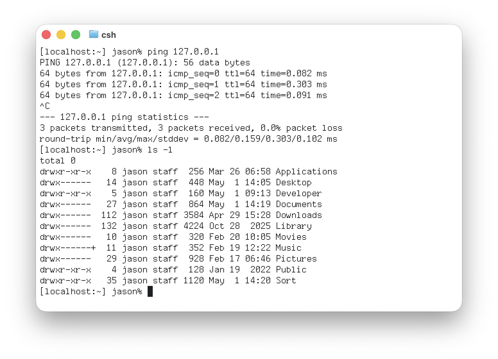

# ohlfs-font-extras



Ohlfs is a bitmap font designed by [Keith Ohlfs](https://worldwideweb.cern.ch/typography/) for the NeXSTEP operating system. This repository includes tooling to add extra glyphs to the font and a bold version. Full credit goes to [Alex Horovitz](https://github.com/AlexHorovitz/Ohlfs-font-to-ttf-conversion) for his preservation and conversion efforts.

## Requirements

- Python 3 with `fontTools`
- `Ohlfs-Light.otf` installed at `~/Library/Fonts/Ohlfs-Light.otf`

## Build

```sh
make install
```

See `make help` for more usage.

## Adding extra glyphs

`gen_extras.py` defines each new glyph as a 15×8 ASCII grid (`#` = on,
`.` = off, top row = y=11, bottom row = y=-3). Add an entry, then:

```sh
make install
```

`make glyphs` dumps every existing Light glyph in the same grid format
(`glyphs.txt`) along with a Unicode coverage report (`missing.txt`).

## Scripts

| `make_bold.py` | Light → Bold via 1-px smear; importable for other faces |
| `gen_extras.py` | Hand-designed glyph definitions → `glyphs-extras.txt` |
| `dump_glyphs.py` | Inspect existing font: glyph dump + coverage report |
| `build.py` | Inject extras into Light → Ohlfs-Extra (Regular + Bold) |
| `Makefile` | `make {sources,glyphs,bold,extra,install,uninstall,verify,clean}` |

## Cell metrics

|           | Light source | Bold output                      |
| --------- | ------------ | -------------------------------- |
| UPM       | 1900         | 1900                             |
| Advance   | 800 (8 px)   | 800 (8 px, glyphs overhang 1 px) |
| Cap area  | y = 0..11    | same                             |
| Descender | y = -3..-1   | same                             |

## Ghostty

The following configuration aims to render the Ohlfs font as closely to the original NeXTSTEP 3.3 Terminal.app.

```
font-family = Ohlfs Extra
font-size = 15
font-synthetic-style = false
adjust-cell-height = 4
```

## Credits

- [Keith Ohlfs](https://worldwideweb.cern.ch/typography/) designed the original Ohlfs bitmap font for NeXTSTEP.
- [Alex Horovitz](https://github.com/AlexHorovitz/Ohlfs-font-to-ttf-conversion) converted and preserved the font as TTF/OTF; this project builds on his work.

## Contributing

All PRs and issues are welcome.
